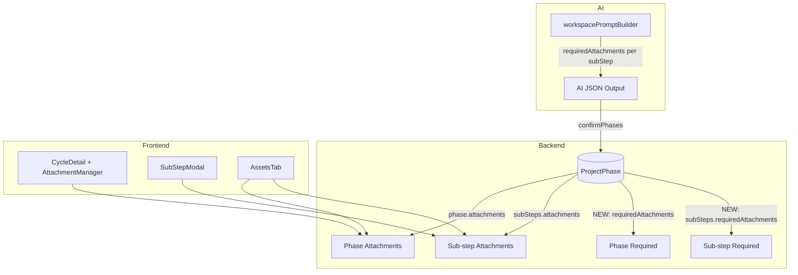

# Enhance Image Sharing Flow

## Current State

- **Phase attachments**: `phase.attachments[]` (filename, url, uploadedBy, uploadedAt, type) — no status or feedback
- **Sub-step attachments**: `phase.subSteps[].attachments[]` — same schema
- **AI workspace proposal**: Generates phases/sub-steps with title, todos; no attachment-related fields
- **UI**: AttachmentManager (phase), SubStepModal (sub-step), AssetsTab (aggregated view) — upload, download, delete only

## Architecture Overview




---

## 1. Schema Changes

### 1.1 Attachment status (phase and sub-step attachments)

Add to both `phase.attachments` and `phase.subSteps[].attachments` in [backend/models/ProjectPhase.js](backend/models/ProjectPhase.js):

```javascript
status: { type: String, enum: ['ok', 'changes_needed'], default: 'ok' },
changesNeededFeedback: { type: String, default: null },
```

- `ok`: default, no action needed
- `changes_needed`: programmer marked as needing fixes; optional `changesNeededFeedback` for details (e.g. "Logo needs higher resolution")

### 1.2 Required attachments (predicted / programmer-defined)

Add to phase and sub-step schemas:

**Phase-level** `requiredAttachments`:

```javascript
requiredAttachments: [{
  label: String,           // e.g. "Logo (PNG/SVG)"
  description: String,     // optional hint
  order: Number,
  receivedAt: Date,       // when client uploaded (null until received)
}]
```

**Sub-step-level** `requiredAttachments` (inside `subSteps`):

```javascript
requiredAttachments: [{
  label: String,
  description: String,
  order: Number,
  receivedAt: Date,
}]
```

- `receivedAt`: set when an attachment is linked or when programmer marks as received (optional UX choice)
- Programmer can add/edit/remove these; AI can pre-populate at generation

---

## 2. AI Integration: Required Attachments in Workspace Proposal

### 2.1 Update workspace prompt builder

In [backend/services/vertexAI/workspacePromptBuilder.js](backend/services/vertexAI/workspacePromptBuilder.js):

- Extend `buildOutputSchemaSection` so each sub-step (and optionally phase) includes `requiredAttachments`:

```json
  "requiredAttachments": [
    { "label": "Logo (PNG or SVG)", "description": "Primary logo for header", "order": 1 },
    { "label": "Brand colors", "description": "Hex codes or style guide", "order": 2 }
  ]
  

```

- Add instructions: "For each sub-step, predict what files/images the client will need to provide (e.g. logo, brand assets, content images, copy). Output requiredAttachments array. Use label and optional description."

### 2.2 Parse and persist in Vertex AI service

In [backend/services/vertexAI/index.js](backend/services/vertexAI/index.js) (`generateWorkspaceProposal`):

- Parse `requiredAttachments` from AI JSON and include in returned sub-steps (and phases if added).

### 2.3 Persist in confirmPhases

In [backend/controllers/projectController.js](backend/controllers/projectController.js) (`confirmPhases`):

- When mapping `d.subSteps` to `subSteps`, include `requiredAttachments: (s.requiredAttachments || []).map(...)`.
- Add `requiredAttachments: []` for phases if phase-level requirements are supported.

---

## 3. Backend API Additions

### 3.1 Update attachment (status / feedback)

**New route**: `PATCH /api/projects/:id/phases/:phaseId/attachments/:attachmentId`

- Body: `{ status?: 'ok' | 'changes_needed', changesNeededFeedback?: string }`
- Permission: programmer or admin only
- Update the attachment subdocument and return updated phase

**New route**: `PATCH /api/projects/:id/phases/:phaseId/sub-steps/:subStepId/attachments/:attachmentId`

- Same body and permission for sub-step attachments

Add handlers in [backend/controllers/projectController.js](backend/controllers/projectController.js) and routes in [backend/routes/projectRoutes.js](backend/routes/projectRoutes.js).

### 3.2 Update required attachments

Include in existing phase/sub-step update flows, or add dedicated endpoints:

- **Phase**: `PATCH /api/projects/:id/phases/:phaseId` — accept `requiredAttachments` in body
- **Sub-step**: `POST /api/projects/:id/phases/:phaseId/sub-steps` (updateSubStep) — accept `requiredAttachments` for the sub-step

Ensure [projectController.js](backend/controllers/projectController.js) `updatePhase` and `updateSubStep` persist `requiredAttachments` when provided.

---

## 4. Frontend API

In [frontend/src/services/projectApi.js](frontend/src/services/projectApi.js) (or equivalent):

- `updateAttachment(projectId, phaseId, attachmentId, { status, changesNeededFeedback })`
- `updateSubStepAttachment(projectId, phaseId, subStepId, attachmentId, { status, changesNeededFeedback })`
- Ensure phase/sub-step update calls support `requiredAttachments` if not already.

---

## 5. UI Changes

### 5.1 AttachmentManager (phase-level)

In [frontend/src/pages/project-pages/ProjectDetail/tabs/WorkspaceTab/components/AttachmentManager.jsx](frontend/src/pages/project-pages/ProjectDetail/tabs/WorkspaceTab/components/AttachmentManager.jsx):

- Show **Required from client** section when `phase.requiredAttachments?.length > 0`:
  - List each with label, description, and a simple "Received" indicator if desired
- For each attachment card:
  - If programmer: add "Mark as changes needed" / "Mark as OK" with optional feedback textarea
  - Show Badge when `status === 'changes_needed'` (e.g. "Changes needed")
- Reuse design tokens: `font-heading`, `font-body`, `rounded-none`, `bg-primary`, etc.

### 5.2 SubStepModal (sub-step level)

In [frontend/src/components/modal-components/SubStepModal/SubStepModal.jsx](frontend/src/components/modal-components/SubStepModal/SubStepModal.jsx):

- Add **Required from client** section for `currentSubStep.requiredAttachments`
- For each attachment: add "Mark as changes needed" / "Mark as OK" (programmer only) and optional feedback
- Show "Changes needed" badge on attachments with that status

### 5.3 CycleDetail – add required attachments management

In [frontend/src/pages/project-pages/ProjectDetail/tabs/WorkspaceTab/components/CycleDetail.jsx](frontend/src/pages/project-pages/ProjectDetail/tabs/WorkspaceTab/components/CycleDetail.jsx):

- Pass `requiredAttachments` and an `onUpdateRequiredAttachments` callback to AttachmentManager (or handle in parent)
- Programmer can add/remove required items (e.g. "+ Add required attachment" with label/description)

### 5.4 AssetsTab

In [frontend/src/pages/project-pages/ProjectDetail/tabs/AssetsTab/AssetsTab.jsx](frontend/src/pages/project-pages/ProjectDetail/tabs/AssetsTab/AssetsTab.jsx):

- Show "Changes needed" badge on asset cards when `item.status === 'changes_needed'`
- Optional: filter by status (All / OK / Changes needed)
- Optional: show `changesNeededFeedback` in a tooltip or expandable area
- Include `subStepId` in aggregated items so AssetsTab can link back to the correct task

---

## 6. Notifications (Optional Enhancement)

- When programmer marks an attachment as "changes needed", notify the client (reuse `createNotification`).
- When client uploads an attachment for a required item, optionally notify the programmer.

---

## 7. Migration / Backward Compatibility

- Existing attachments: treat missing `status` as `'ok'`
- Existing phases/sub-steps: treat missing `requiredAttachments` as `[]`
- No DB migration required if defaults are applied in code

---

## 8. Validation and Testing

- Use Browser MCP (e.g. `browser_snapshot`, `browser_click`) to verify:
  - Required attachments section in CycleDetail and SubStepModal
  - "Mark as changes needed" flow and badge display
  - AssetsTab filter and badge
- Ensure design system compliance: `rounded-none`, `font-heading`, `font-body`, `bg-primary`, etc.

---

## File Summary


| Layer      | Files to Modify                                                                                                                                                                                                                                                                                                                                                                                                                      |
| ---------- | ------------------------------------------------------------------------------------------------------------------------------------------------------------------------------------------------------------------------------------------------------------------------------------------------------------------------------------------------------------------------------------------------------------------------------------ |
| Model      | [backend/models/ProjectPhase.js](backend/models/ProjectPhase.js)                                                                                                                                                                                                                                                                                                                                                                     |
| AI         | [backend/services/vertexAI/workspacePromptBuilder.js](backend/services/vertexAI/workspacePromptBuilder.js), [backend/services/vertexAI/index.js](backend/services/vertexAI/index.js)                                                                                                                                                                                                                                                 |
| Controller | [backend/controllers/projectController.js](backend/controllers/projectController.js)                                                                                                                                                                                                                                                                                                                                                 |
| Routes     | [backend/routes/projectRoutes.js](backend/routes/projectRoutes.js)                                                                                                                                                                                                                                                                                                                                                                   |
| API client | [frontend/src/services/projectApi.js](frontend/src/services/projectApi.js) (or api service)                                                                                                                                                                                                                                                                                                                                          |
| UI         | [AttachmentManager.jsx](frontend/src/pages/project-pages/ProjectDetail/tabs/WorkspaceTab/components/AttachmentManager.jsx), [SubStepModal.jsx](frontend/src/components/modal-components/SubStepModal/SubStepModal.jsx), [CycleDetail.jsx](frontend/src/pages/project-pages/ProjectDetail/tabs/WorkspaceTab/components/CycleDetail.jsx), [AssetsTab.jsx](frontend/src/pages/project-pages/ProjectDetail/tabs/AssetsTab/AssetsTab.jsx) |


---

## Open Questions

1. **Linking received attachments to required items**: Should we auto-link when the client uploads (e.g. by matching label) or let the programmer manually mark "Received" on a required item? Simpler approach: programmer marks required item as received when satisfied.
2. **Phase-level required attachments**: Should AI also predict phase-level requirements, or only sub-step level? Recommendation: start with sub-step; add phase-level if needed.
3. **Client visibility of "changes needed"**: Should the client see the feedback in the same view (e.g. SubStepModal when they have read access)? Recommendation: yes, so they know what to fix.

