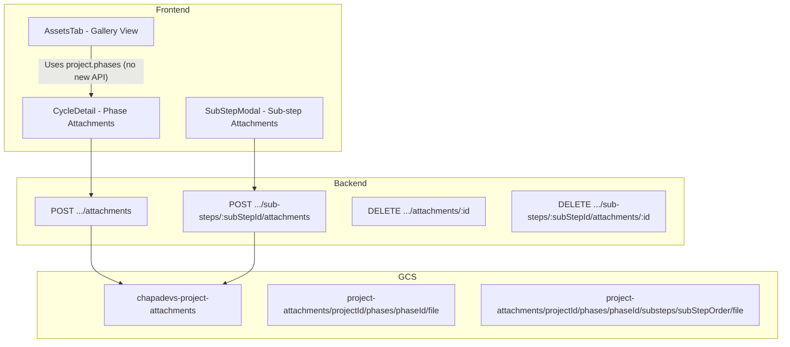

# GCS Project Images and Assets Tab

## Architecture Overview




---

## 1. GCS Bucket Setup

**Manual step (outside code):**

- Create bucket `chapadevs-project-attachments` in GCP (same project as existing `chapadevs-website`)
- Set bucket to **uniform bucket-level access** with public read (for shareable URLs), or use signed URLs if you prefer private access
- Add CORS if needed for direct browser uploads (not required for server-side upload)

**Env variable:**

- Add `GCS_PROJECT_ATTACHMENTS_BUCKET=chapadevs-project-attachments` to backend `.env` (fallback: `chapadevs-project-attachments`)

---

## 2. Backend: GCS Storage Utility

**New file:** [backend/utils/projectAttachmentStorage.js](backend/utils/projectAttachmentStorage.js)

- `uploadProjectAttachment(projectId, phaseId, fileBuffer, filename, mimeType, subStepOrder?)`  
  - Path: `project-attachments/{projectId}/phases/{phaseId}/{uniqueId}.{ext}` or `.../substeps/{subStepOrder}/{uniqueId}.{ext}`
  - Upload to GCS, return **public URL** (e.g. `https://storage.googleapis.com/bucket/path`) or object path for signed URL
- `deleteProjectAttachment(urlOrPath)` – parse path from URL, delete from GCS
- Reuse `getStorage()` pattern from [backend/utils/gcsImageStorage.js](backend/utils/gcsImageStorage.js) (same service account)

---

## 3. Backend: Multer Memory Storage

**File:** [backend/controllers/projectController.js](backend/controllers/projectController.js)

- Replace `multer.diskStorage` with `multer.memoryStorage()` so `req.file.buffer` is available for GCS upload
- Keep `upload.single('file')` middleware; remove filesystem writes

---

## 4. Backend: Phase Attachment Migration

**File:** [backend/controllers/projectController.js](backend/controllers/projectController.js)

**uploadAttachment (lines 1105–1154):**

- After `req.file` validation, call `uploadProjectAttachment(projectId, phaseId, req.file.buffer, req.file.originalname, req.file.mimetype)`
- Store returned GCS URL in `attachment.url` instead of `/uploads/phases/...`

**deleteAttachment (lines 1159–1215):**

- If `attachment.url` is a GCS URL, call `deleteProjectAttachment(attachment.url)` instead of `fs.unlinkSync`
- If legacy `/uploads/phases/...`, keep existing filesystem delete for backward compatibility

---

## 5. Backend: Sub-step Attachments

**Schema:** [backend/models/ProjectPhase.js](backend/models/ProjectPhase.js)

Add `attachments` to sub-step schema (inside `subSteps` array, ~line 81):

```javascript
attachments: {
  type: [{
    filename: { type: String, required: true },
    url: { type: String, required: true },
    uploadedBy: { type: mongoose.Schema.Types.ObjectId, ref: 'User', required: true },
    uploadedAt: { type: Date, default: Date.now },
    type: { type: String, default: 'file' },
  }],
  default: [],
},
```

**Routes:** [backend/routes/projectRoutes.js](backend/routes/projectRoutes.js)

- `POST /projects/:id/phases/:phaseId/sub-steps/:subStepId/attachments` – upload to GCS, append to `phase.subSteps[].attachments`
- `DELETE /projects/:id/phases/:phaseId/sub-steps/:subStepId/attachments/:attachmentId` – delete from GCS, splice from array

**Controller:** [backend/controllers/projectController.js](backend/controllers/projectController.js)

- Add `uploadSubStepAttachment` and `deleteSubStepAttachment` (mirror phase logic, use `subStepOrder` or `_id` to find sub-step)

---

## 6. Frontend: AttachmentManager URL Handling

**File:** [frontend/src/pages/project-pages/ProjectDetail/tabs/WorkspaceTab/components/AttachmentManager.jsx](frontend/src/pages/project-pages/ProjectDetail/tabs/WorkspaceTab/components/AttachmentManager.jsx)

- `getFileUrl(url)` already returns `url` as-is when it starts with `http` – GCS URLs will work
- No change needed if GCS returns full public URLs

---

## 7. Frontend: Sub-step Attachments in SubStepModal

**File:** [frontend/src/components/modal-components/SubStepModal/SubStepModal.jsx](frontend/src/components/modal-components/SubStepModal/SubStepModal.jsx)

- Add an Attachments section (reuse patterns from AttachmentManager: upload, list, thumbnail, download, delete)
- New API: `projectAPI.uploadSubStepAttachment(projectId, phaseId, subStepId, formData)` and `deleteSubStepAttachment(...)`
- Pass `project`, `phase`, `subStep`, `canUpload`, `onUpdate` (to refresh phase after add/delete)

**File:** [frontend/src/services/projectApi.js](frontend/src/services/projectApi.js)

- Add `uploadSubStepAttachment` and `deleteSubStepAttachment`

---

## 8. Frontend: Assets Tab

**New file:** `frontend/src/pages/project-pages/ProjectDetail/tabs/AssetsTab/AssetsTab.jsx`

- Aggregate attachments from `project.phases` (phase-level) and `phase.subSteps[].attachments` (sub-step-level)
- Display as responsive grid of thumbnails (48x48 or 64x64)
- Each item: thumbnail, filename, phase name, sub-step name (if applicable), uploaded date
- Actions: open in new tab, copy link (GCS URL), download
- Optional: filter by phase (dropdown)
- Optional: lightbox for full-size view (Dialog + img)
- Use `max-w-[1200px] mx-auto` and design tokens per [.cursor/rules/design-pattern.mdc](.cursor/rules/design-pattern.mdc)

**File:** [frontend/src/pages/project-pages/ProjectDetail/components/ProjectSidebar/ProjectSidebar.jsx](frontend/src/pages/project-pages/ProjectDetail/components/ProjectSidebar/ProjectSidebar.jsx)

- Add `{ id: "assets", label: "Assets", icon: ImageIcon, show: true }` to `navItems` (import `Image` or `ImageIcon` from lucide-react)

**File:** [frontend/src/pages/project-pages/ProjectDetail/ProjectDetail.jsx](frontend/src/pages/project-pages/ProjectDetail/ProjectDetail.jsx)

- Import `AssetsTab`, add `activeTab === 'assets' && <AssetsTab project={project} />` in tab content

---

## 9. Backward Compatibility

- **Legacy URLs:** Attachments with `url: '/uploads/phases/...'` continue to work via `getFileUrl` (backend base + path)
- **Migration:** Existing files in `uploads/phases/` remain on disk; new uploads go to GCS. Optional: one-time script to migrate old files to GCS and update DB (out of scope for initial plan)

---

## 10. File Summary


| Action | File                                                                                                |
| ------ | --------------------------------------------------------------------------------------------------- |
| Create | `backend/utils/projectAttachmentStorage.js`                                                         |
| Edit   | `backend/controllers/projectController.js` (multer memory, upload/delete to GCS, sub-step handlers) |
| Edit   | `backend/models/ProjectPhase.js` (sub-step attachments)                                             |
| Edit   | `backend/routes/projectRoutes.js` (sub-step attachment routes)                                      |
| Edit   | `frontend/src/services/projectApi.js` (sub-step API)                                                |
| Edit   | `frontend/src/components/modal-components/SubStepModal/SubStepModal.jsx` (attachments UI)           |
| Create | `frontend/src/pages/project-pages/ProjectDetail/tabs/AssetsTab/AssetsTab.jsx`                       |
| Edit   | `frontend/src/pages/project-pages/ProjectDetail/components/ProjectSidebar/ProjectSidebar.jsx`       |
| Edit   | `frontend/src/pages/project-pages/ProjectDetail/ProjectDetail.jsx`                                  |


---

## 11. URL Strategy

- **Public bucket:** Store `https://storage.googleapis.com/chapadevs-project-attachments/...` in DB. Shareable, no expiry.
- **Private bucket:** Store GCS path only; backend provides signed URL endpoint if needed. More secure, URLs expire.

Recommendation: Start with **public bucket** for simplicity and easy sharing; switch to signed URLs later if required.