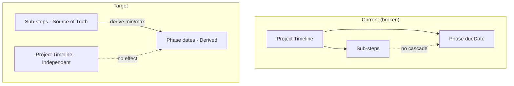

# Phase/Cycle Reset and Date Cascade System

## Problem Summary

1. **Phase due date does not update when sub-step dates change** – Changing a sub-step date (e.g. +10 days) updates other sub-steps via `applyDateCascade`, but `phase.dueDate` stays unchanged because the backend never recalculates it from sub-steps.
2. **Project timeline used as fallback for phase dates** – `getPhaseDateRange` and `WeekTimeline` fall back to `project.startDate` + phase order when phase dates are missing, coupling phases to the project timeline.
3. **No phase reset capability** – Phases can only be deleted (reject/unassign); there is no way to reset a phase to `not_started` or re-sync dates.

---

## Architecture: Date Flow (Current vs Target)




---

## Implementation Plan

### 1. Backend: Derive Phase Dates from Sub-steps on Update

**File:** [backend/controllers/projectController.js](backend/controllers/projectController.js)

When `updatePhase` receives `subSteps`, after normalizing and assigning them to `phase.subSteps`, add logic to derive and set `phase.startedAt` and `phase.dueDate` from sub-steps:

- Create a helper `derivePhaseDatesFromSubSteps(subSteps)` that:
  - Sorts sub-steps by `order`
  - Collects all `startDate` and `dueDate` (including derived from `dueDate - estimatedDurationDays` when `startDate` is missing)
  - Returns `{ startedAt: min(startDates), dueDate: max(dueDates) }` when at least one sub-step has dates
- After the `phase.subSteps = req.body.subSteps.map(...)` block, call this helper and set `phase.startedAt` and `phase.dueDate` when the result is non-null.
- Ensure date strings from the client are parsed to `Date` before saving (Mongoose will accept ISO strings; we should normalize for consistency).

**Location:** Insert after line ~805 (after the subSteps mapping block, before `phase.save()`).

---

### 2. Backend: Add `derivePhaseDatesFromSubSteps` Utility

**File:** Create [backend/utils/phaseDateUtils.js](backend/utils/phaseDateUtils.js) (or add to existing [backend/utils/phaseWorkflow.js](backend/utils/phaseWorkflow.js))

```javascript
/**
 * Derive phase startedAt and dueDate from sub-steps.
 * startedAt = min of first sub-step startDate (or derived from dueDate - estimatedDurationDays)
 * dueDate = max of last sub-step dueDate
 * Returns nulls if no sub-steps have dates.
 */
export function derivePhaseDatesFromSubSteps(subSteps) { ... }
```

This keeps the logic reusable and testable.

---

### 3. Frontend: Update `getPhaseDateRange` – Sub-steps First, Project Last

**File:** [frontend/src/utils/calendarDateUtils.js](frontend/src/utils/calendarDateUtils.js)

Change the priority order in `getPhaseDateRange(phase, project, phases)`:

1. **First:** If `phase.subSteps` has any items with `startDate` or `dueDate`, derive phase range from sub-steps:
  - `startDate` = min of sub-step start dates (explicit or derived)
  - `dueDate` = max of sub-step due dates
2. **Second:** If `phase.startedAt` and `phase.dueDate` exist, use them.
3. **Last resort:** Fall back to `project.startDate` + phase order + `estimatedDurationDays` (for backward compatibility with phases that have no sub-step dates).

This makes sub-steps the source of truth for display and decouples phase dates from the project timeline when sub-steps have dates.

---

### 4. Frontend: Update `WeekTimeline` to Use Same Logic

**File:** [frontend/src/pages/project-pages/ProjectDetail/tabs/WorkspaceTab/components/WeekTimeline.jsx](frontend/src/pages/project-pages/ProjectDetail/tabs/WorkspaceTab/components/WeekTimeline.jsx)

Refactor to use a shared helper (e.g. `getPhaseDateRange` from `calendarDateUtils`) instead of duplicating the phase date logic. This ensures `WeekTimeline` also derives from sub-steps first and stays consistent with the calendar.

---

### 5. Phase/Cycle Reset System

**Scope:** Add a "Reset phase" action that:

- Sets `status` to `not_started`
- Clears `startedAt` and `completedAt`
- Optionally resets sub-step `status` to `pending` (and `completed` to `false`)

**Backend:**

- Extend `updatePhase` to accept `reset: true` (or add a dedicated route `POST /:id/phases/:phaseId/reset`).
- When reset is requested: set `status: 'not_started'`, `startedAt: null`, `completedAt: null`, and optionally reset all sub-step `status`/`completed`.
- After reset, if sub-steps have dates, still derive `phase.dueDate` from sub-steps (phase dates remain tied to sub-steps).

**Frontend:**

- Add a "Reset phase" button in [CycleDetail.jsx](frontend/src/pages/project-pages/ProjectDetail/tabs/WorkspaceTab/components/CycleDetail.jsx) (e.g. in phase header or settings), visible only when `canChangePhaseStatus` and phase is `in_progress` or `completed`.
- Call the new reset endpoint or `updatePhase` with reset payload.

---

### 6. Sub-step Date Cascade: Ensure Phase Dates Are Included in Response

**File:** [backend/controllers/projectController.js](backend/controllers/projectController.js)

After applying `derivePhaseDatesFromSubSteps` and before `phase.save()`, the updated `phase.startedAt` and `phase.dueDate` will be persisted. The existing `res.json(updated)` returns the phase from DB, so the frontend will receive the recalculated dates. No API changes needed.

---

### 7. Consistency Safeguards

- **Reordering sub-steps:** When sub-steps are reordered via `handleSubStepsReorder` in CycleDetail, the backend receives full `subSteps` with dates. The new `derivePhaseDatesFromSubSteps` will run and update phase dates. No extra work needed.
- **New sub-steps without dates:** If a new sub-step has no dates, the helper should ignore it when computing min/max. Phases with mixed dated/undated sub-steps: use only sub-steps that have dates.
- **Empty sub-steps:** If all sub-steps are removed or have no dates, do not overwrite `phase.startedAt`/`phase.dueDate` with null (preserve existing phase dates for backward compatibility). Only update when the derived values are non-null.

---

## Files to Modify


| File                                       | Changes                                                                  |
| ------------------------------------------ | ------------------------------------------------------------------------ |
| `backend/utils/phaseDateUtils.js`          | New file: `derivePhaseDatesFromSubSteps`                                 |
| `backend/controllers/projectController.js` | Call helper after subSteps update; add reset handling                    |
| `frontend/src/utils/calendarDateUtils.js`  | Add sub-step–first logic to `getPhaseDateRange`                          |
| `frontend/src/pages/.../WeekTimeline.jsx`  | Use `getPhaseDateRange` from calendarDateUtils                           |
| `frontend/src/pages/.../CycleDetail.jsx`   | Add Reset phase button and handler                                       |
| `backend/routes/projectRoutes.js`          | Optional: add `POST /:id/phases/:phaseId/reset` if using dedicated route |


---

## Edge Cases

- **Sub-step with only `dueDate`:** Derive `startDate` as `dueDate - estimatedDurationDays` when computing min.
- **Sub-step with only `startDate`:** Use `startDate + estimatedDurationDays` for max if `dueDate` is missing.
- **Phase `startedAt` from status:** When status moves to `in_progress`, `startedAt` is set to `new Date()`. After a sub-step date update, we will overwrite it with the derived value. Consider: should `startedAt` from status take precedence over derived? User said phases should relate to sub-step dates. Recommendation: always derive from sub-steps when sub-steps have dates; the "in progress" moment is logical, not necessarily the first sub-step start. If preferred, we could only derive `dueDate` and keep `startedAt` from status—clarify with user if needed.
- **confirmPhases:** Initial creation still uses project timeline. After creation, all edits flow through `updatePhase`, which will derive phase dates from sub-steps. No change to confirmPhases required.

---

## Testing Checklist

- Change a sub-step due date (+10 days) → phase due date updates.
- Change a sub-step start date → phase startedAt updates (when derived from sub-steps).
- Reorder sub-steps → phase dates remain consistent with sub-step min/max.
- Phase with no sub-step dates → falls back to phase.startedAt/dueDate or project (backward compat).
- Reset phase → status `not_started`, startedAt/completedAt cleared; phase due date still derived from sub-steps if present.

